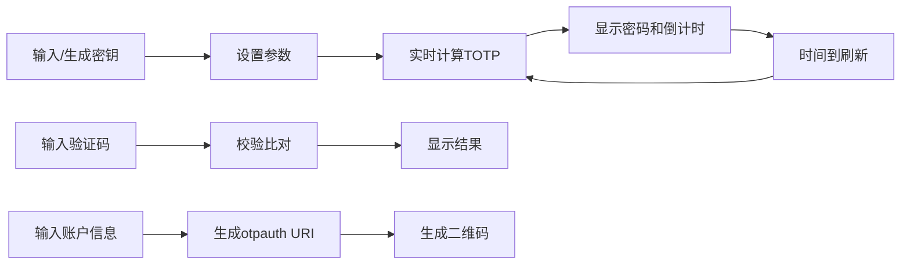

## 1. 产品概述

TOTP（基于时间的一次性密码）验证器演示网页，帮助用户理解和体验双因素认证的工作原理。用户可以生成、查看、验证一次性密码，并支持与Google Authenticator等手机APP联动。

- 核心用途：学习和演示TOTP认证机制，提供可视化的密码生成和验证体验
- 目标用户：开发者、安全学习者、对双因素认证感兴趣的普通用户
- 产品价值：降低TOTP技术的理解门槛，提供可交互的演示环境

## 2. 核心功能

### 2.1 用户角色
无需登录，所有用户均可直接使用全部功能。

### 2.2 功能模块
1. **密钥管理模块**：Base32密钥输入、随机生成密钥、URI格式导入导出
2. **参数设置模块**：步长（时间周期）设置、密码位数设置
3. **密码展示模块**：实时显示当前动态密码、倒计时进度条、剩余秒数
4. **验证模块**：输入TOTP码进行校验、显示验证结果
5. **二维码模块**：生成Google Authenticator兼容的二维码、方便手机扫描添加

### 2.3 页面详情

| 页面名称 | 模块名称 | 功能描述 |
|---------|---------|---------|
| 首页 | 密钥管理区 | Base32密钥输入框、随机生成按钮、导入/导出URI按钮 |
| 首页 | 参数设置区 | 步长滑块/输入框、位数下拉选择 |
| 首页 | 密码展示区 | 大号动态密码显示、环形/线性倒计时进度条、剩余秒数 |
| 首页 | 验证区 | TOTP码输入框、验证按钮、验证结果提示 |
| 首页 | 二维码区 | Google Authenticator二维码、账户名称输入、发行方输入 |

## 3. 核心流程

### 3.1 生成并查看TOTP密码
1. 用户输入或随机生成Base32密钥
2. 设置步长（默认30秒）和位数（默认6位）
3. 系统实时计算并显示当前动态密码
4. 倒计时进度条显示剩余有效时间
5. 时间周期结束后自动刷新密码

### 3.2 验证TOTP密码
1. 用户在验证框输入待校验的TOTP码
2. 点击验证按钮
3. 系统比对当前时间窗口内的有效密码
4. 显示验证成功或失败的结果

### 3.3 生成二维码
1. 用户输入账户名称和发行方名称
2. 系统根据密钥和参数生成otpauth URI
3. 将URI编码为二维码图片
4. 用户可用Google Authenticator扫描添加

## 4. 用户界面设计

### 4.1 设计风格
- **设计主题**：科技感深色主题，搭配霓虹绿色强调色，营造安全/黑客风格的视觉氛围
- **主色调**：深灰蓝背景（#0f172a）、卡片背景（#1e293b）
- **强调色**：霓虹绿（#22c55e）用于密码显示和成功状态、橙红（#ef4444）用于警告和错误
- **字体**：使用等宽字体（JetBrains Mono / Fira Code）展示密码，搭配现代无衬线字体
- **布局风格**：卡片式布局，左右分栏，左侧为设置区，右侧为展示区
- **动效**：密码切换有淡入淡出动画，倒计时进度条平滑过渡

### 4.2 页面设计概述

| 页面名称 | 模块名称 | UI元素 |
|---------|---------|-------|
| 首页 | 密钥管理区 | 带复制按钮的输入框、骰子图标生成按钮、导入导出按钮组 |
| 首页 | 参数设置区 | 数值输入框+步进器、下拉选择器、标签说明 |
| 首页 | 密码展示区 | 超大号等宽字体密码、环形进度条、秒数数字、刷新图标 |
| 首页 | 验证区 | 6格验证码输入框、验证按钮、成功/失败状态提示 |
| 首页 | 二维码区 | 二维码图片展示框、账户名输入框、发行方输入框 |

### 4.3 响应式
- 桌面端（>768px）：左右两栏布局，左侧设置区，右侧展示区
- 移动端（<=768px）：上下堆叠布局，密码展示区在最上方
- 触摸优化：按钮尺寸足够大，输入框适合手指点击

### 4.4 视觉细节
- 密码数字使用等宽字体，每个数字有轻微的字符间距
- 倒计时即将结束时（最后5秒）颜色变为橙色警告
- 验证成功有绿色勾选动画，失败有红色抖动效果
- 卡片有微妙的悬停阴影提升
- 使用细边框和玻璃拟态效果增加层次感
