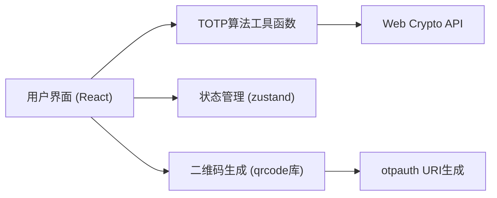
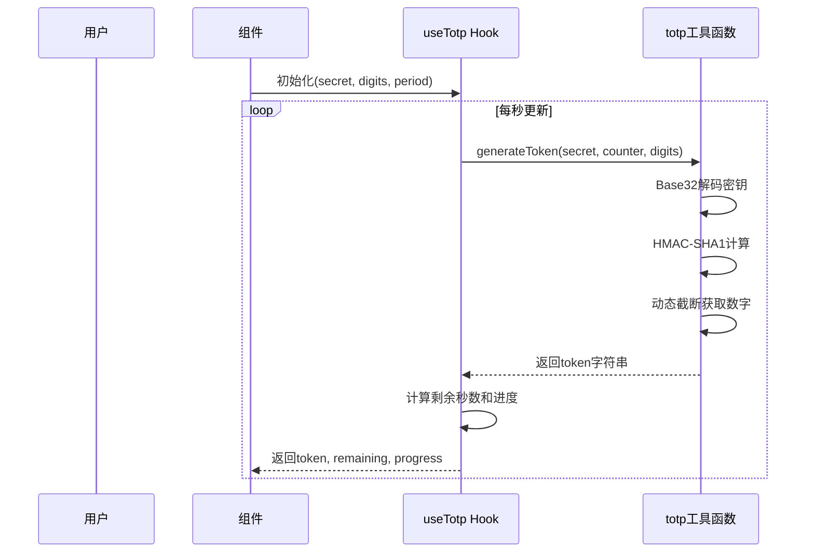

## 1. 架构设计

纯前端单页应用，所有TOTP计算在浏览器本地完成，无需后端服务。



## 2. 技术描述

- **前端框架**：React@18 + TypeScript
- **构建工具**：Vite@5
- **样式方案**：TailwindCSS@3
- **状态管理**：zustand
- **图标库**：lucide-react
- **二维码生成**：qrcode@1.5（或 qrcode.react）
- **路由**：无需路由，单页应用

## 3. 项目结构

```
src/
├── components/
│   ├── KeyManager.tsx       # 密钥管理组件
│   ├── ParamsSettings.tsx   # 参数设置组件
│   ├── TotpDisplay.tsx      # 密码展示组件
│   ├── Verification.tsx     # 验证组件
│   └── QrCodeSection.tsx    # 二维码组件
├── hooks/
│   └── useTotp.ts           # TOTP核心逻辑Hook
├── utils/
│   ├── totp.ts              # TOTP算法实现
│   ├── base32.ts            # Base32编解码
│   └── uri.ts               # otpauth URI解析与生成
├── store/
│   └── useTotpStore.ts      # 全局状态
├── App.tsx
├── main.tsx
└── index.css
```

## 4. 核心数据模型

### 4.1 TOTP配置状态
```typescript
interface TotpConfig {
  secret: string;           // Base32 密钥
  digits: number;           // 密码位数 (6-8)
  period: number;           // 步长/周期 (秒)
  algorithm: 'SHA1' | 'SHA256' | 'SHA512'; // 哈希算法
  issuer: string;           // 发行方名称
  account: string;          // 账户名称
}
```

### 4.2 TOTP计算结果
```typescript
interface TotpResult {
  token: string;            // 当前动态密码
  remainingSeconds: number; // 剩余有效秒数
  progress: number;         // 进度百分比 (0-100)
  timeWindow: number;       // 当前时间窗口编号
}
```

## 5. TOTP算法流程



## 6. otpauth URI格式

**生成格式**：
```
otpauth://totp/<issuer>:<account>?secret=<secret>&issuer=<issuer>&digits=<digits>&period=<period>&algorithm=<algorithm>
```

**解析功能**：
- 从URI字符串中提取所有参数
- 导入URI时自动填充配置表单

## 7. 验证逻辑

- 验证当前时间窗口的TOTP码
- 可配置容错窗口（默认1个窗口，即±0步）
- 返回验证成功/失败状态和时间偏移信息
